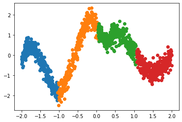
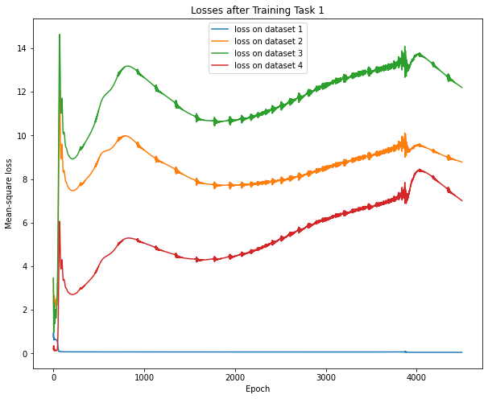
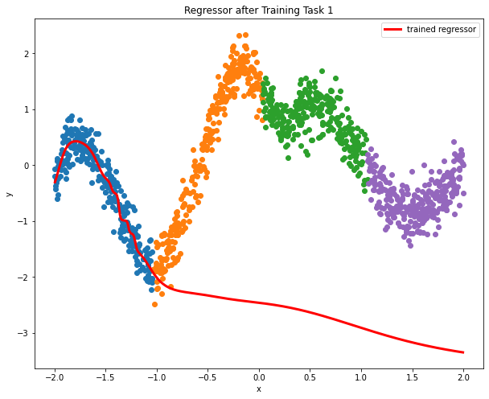
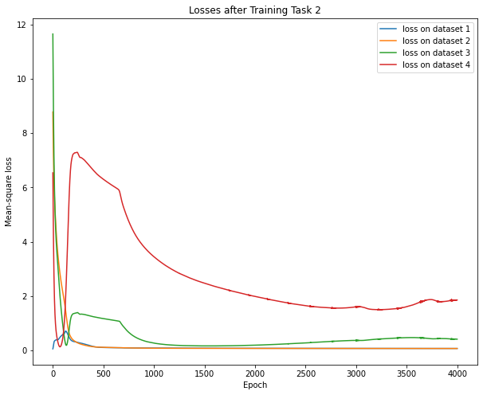
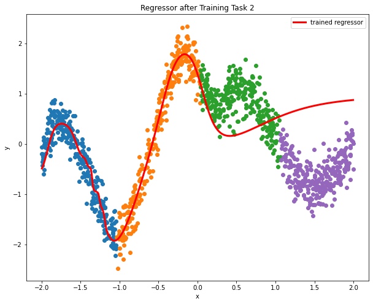
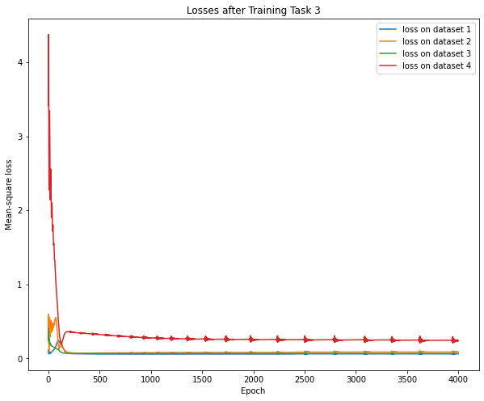
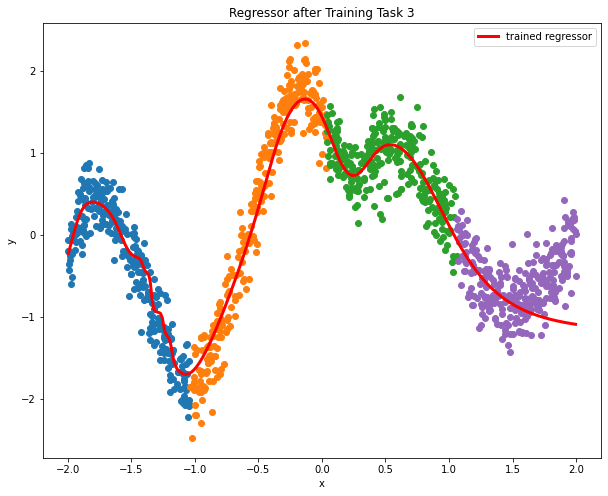
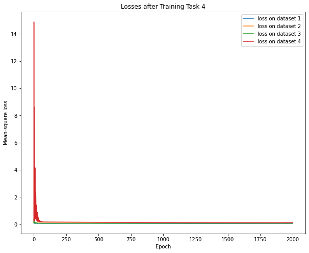

<!-- Example modified from [here](http://www.unexpected-vortices.com/sw/rippledoc/quick-markdown-example.html){:target="_blank"}. -->

Motivation of Online EWC
============

In real applications, offline EWC can be costly in case of a large number of tasks and
will become more and more expensive as the task number grows. This is because offline EWC
tends to store the fisher information matrix of every task trained before and this can be
huge with a large number of tasks. This is where online EWC comes to the rescue.

How Online EWC works
--------------

Online EWC maintains a constant low cost as task number increases. This is achieved by always maintaining one fisher information matrix rather that many.
So for the regularizer, instead of being a trail of fisher information matrix like &lambda;1F1 +
&lambda;2F2 + ..., it can be as simple as a single term &lambda;F.

The crux of online EWC is updating the fisher information matrix. Each time a new task is trained, 
the fisher information matrix will be updated using a given weight.
Let's assume the old fisher information matrix is Fold, the significance level of the new task is S, 
and the new fisher information matrix is Fnew. Also, let
the weight of the new task be &alpha;. Mathematically, the update process can be expressed as

    Fnew = &alpha; Fold + (1 - &alpha;) S

Implementation of Online EWC
--------------

To implement the online EWC method, we first define the online EWC class using pytorch

~~~python
class OnlineEWC:
    def __init__(self, model: nn.Module, loss=nn.MSELoss()):
        self._model = model
        self._params = {}
        self._fim = {}
        self._loss = loss
        self._loss_lst = {}
        self._optim = None
        self._lambda = 0
        self._time = 0

    def train(self, inputs, labels, index, lr, alpha = 0.5, lam=0, epochs=500):
        self._loss_lst = {}
        self._optim = torch.optim.Adam(self._model.parameters(), lr=lr)

        loss_values_x1 = []
        self._lambda = lam
        self._time = 0

        # training
        for _ in range(epochs):
            start_time = time.time()
            f = self._model(inputs[index].float())
            regularizer = 0
            if len(self._params) != 0:
                loss_ewc = 0
                for n, p in self._model.named_parameters():
                    loss_ewc += torch.matmul(self._fim[n].T, (torch.reshape(p, (-1,1)) - torch.reshape(self._params[n], (-1,1))) ** 2)
                regularizer += self._lambda * loss_ewc

            loss = self._loss(f, labels[index].unsqueeze(1).float()) + regularizer
            self._optim.zero_grad()
            loss.backward()
            self._optim.step()
            self._time += time.time() - start_time

            # store loss
            loss_values_x1.append(loss.item())

            if index in self._loss_lst:
                self._loss_lst[index].append(loss_values_x1[-1])
            else:
                self._loss_lst[index] = [loss_values_x1[-1]]

            for i in range(len(inputs)):
                if i != index:
                    tmp_f = self._model(inputs[i].float())
                    tmp_loss = self._loss(tmp_f, labels[i].unsqueeze(1).float())
                    if i in self._loss_lst:
                        self._loss_lst[i].append(tmp_loss)
                    else:
                        self._loss_lst[i] = [tmp_loss]

        start_time = time.time()
        for n, p in deepcopy(self._model).named_parameters():
            if p.requires_grad:
                self._params[n] = p

        # update fisher information matrix
        f = self._model(inputs[index].float())
        loss = self._loss(f, labels[index].unsqueeze(1).float())
        self._optim.zero_grad()
        loss.backward()

        temp_fisher = {}
        for n, p in self._model.named_parameters():
            temp_fisher[n] = torch.reshape(p.grad.data, (-1,1))

        for n, p in temp_fisher.items():
            if n in self._fim:
                self._fim[n] = self._fim[n]*alpha + p**2 * (1-alpha)
            else:
                self._fim[n] = p**2
        self._time += time.time() - start_time
~~~

To compare online EWC with offline EWC, it's a good time to conduct experiments on online EWC with the same sample data 
as that of offline EWC. The sample data we use is as follows

To tackle this problem, we use a 4-hidden-layer MLP with perceptron number of 1, 100, 100, 100, 100, and 1.

Below is the trace of the experiments after each individual task being trained

Task 1:

Task 2:

Task 3:

Task 4:

Not bad, right? Just like we did for the offline EWC, the time duration for each training is recorded.
They are 12.9, 18.0, 17.0, and 9.2 seconds. It seems that online EWC achieves a balance between the
accuracy-cost tradeoff.

